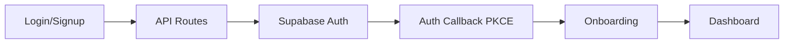
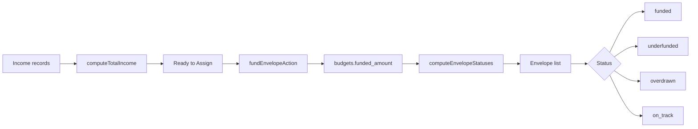

# FireTogether

**Couples' finance, together.** Track shared expenses, budget with envelopes, set savings goals, and know where your money goes — as a team.

| | |
|---|---|
| **Stack** | Next.js 16, React 19, Supabase, Tailwind CSS v4 |
| **Auth** | Supabase Auth (email/password + Google OAuth) |
| **UI** | shadcn/base-ui, Lucide icons, Recharts |
| **Routing** | App Router, server actions, RSC |
| **Mobile** | Responsive web, PWA-ready, iOS Shortcut |
| **Database** | PostgreSQL via Supabase, RLS, 4 migrations |

---

## At a glance

| Measure | Count |
|---|---|
| Pages | 11 routes |
| API routes | 7 |
| Server actions | 18 |
| Database tables | 7 |
| Migrations | 4 |
| UI components | 9 (shadcn) |
| Custom components | 20+ |
| Icons | 13 Lucide icon map |

---

## Core concepts

FireTogether is built around a few mental models that make couples' finance different from personal finance.

**Split everything.** Every expense has a split type — shared (50/50), custom ratio, or personal. The dashboard shows each person's responsibility, not just who paid.

**Envelope budgeting.** Income flows in, you fund envelopes (categories), and spending is tracked against what you've set aside. The "Ready to assign" number is your north star — give every dollar a job.

**No accounts.** FireTogether skips account/transaction reconciliation in favor of direct expense entry. You log what you spend; the app handles the split and tracks the balance.

**Built for two.** The couple is the unit — invite codes, shared categories, shared goals, and balance timelines that show who owes what.

---

## Quick start

### Prerequisites

- Node.js 20+
- A [Supabase](https://supabase.com) project
- npm or equivalent

### Setup

```bash
# 1. Clone and install
git clone <repo-url> firetogether
cd firetogether
npm install

# 2. Configure environment
cp .env.local.example .env.local
```

Fill in `.env.local`:

| Variable | Description |
|---|---|
| `NEXT_PUBLIC_SUPABASE_URL` | Your Supabase project URL |
| `NEXT_PUBLIC_SUPABASE_ANON_KEY` | Supabase anon/public key |
| `SUPABASE_SERVICE_ROLE_KEY` | Service role key (admin bypass) |

### Database

Apply migrations to your Supabase project in order:

```bash
supabase/migrations/001_initial_schema.sql
supabase/migrations/002_auto_create_user.sql     # or 002_shortcut_token.sql
supabase/migrations/003_drop_broken_trigger.sql   # if needed
supabase/migrations/003_fix_auto_create_user_trigger.sql
supabase/migrations/004_envelope_budgeting.sql
```

Each migration is additive and idempotent (`IF NOT EXISTS`, `DROP POLICY IF EXISTS`).

### Run

```bash
npm run dev        # → http://localhost:3000
npm run build      # Production build
npm run start      # Start production server
```

---

## Features

### 1. Expenses

The core of the app. Every expense records:

- **Amount** and **description**
- **Category** (from your couple's list or uncategorized)
- **Split type**: shared (50/50), custom ratio, or personal
- **Who paid** — the logged-in user who enters it
- **Date** (defaults to today)

**Pages:**

| Route | Description |
|---|---|
| `/expenses` | Paginated list (20/page), filterable by month and category. Shows per-person share breakdown. Export to CSV or categories text report. |
| `/expenses/new` | Create a new expense. Shows current user as payer with a link to iOS Shortcut setup. |
| `/expenses/[id]/edit` | Edit or delete an existing expense. |

**Server actions:**

| Action | File | Description |
|---|---|---|
| `createExpenseAction` | `expenses/new/actions.ts` | Validates amount > 0, valid date, valid category; inserts via service client |
| `updateExpenseAction` | `expenses/actions.ts` | Updates fields on existing expense after ownership check |
| `deleteExpenseAction` | `expenses/actions.ts` | Deletes expense after ownership check |

### 2. Dashboard

The main hub (`/dashboard`), organized as a single scrollable page:

- **Month selector** — navigate between months
- **Ready to assign** — income vs. funded envelope bar
- **Balance timeline** — stacked bar chart showing who-paid per month, with net balance line
- **Spending trends sparkline** — 6-month trend with direction arrow
- **Expense streaks** — current streak, longest streak, milestones
- **Recurring expenses** — auto-detected (same category + amount appearing 2+ months)
- **Spending insights** — category-level comparisons vs. previous month
- **Spend map** — category breakdown chart with drill-down history dialog
- **Envelope statuses** — quick view of funded envelopes
- **Goals** — savings goal progress
- **Workspace dialog** — invite code sharing, member list

### 3. Envelope budgeting

At `/budgets`. Based on the classic envelope method: income → assign to envelopes → spend against funded amounts.

**The hero** shows your north star: **Ready to assign** (income − total funded). The page is split into a sidebar (forms) and main card (envelope list).

**Forms (sidebar):**

| Form | Description |
|---|---|
| **Create envelope** | Pick a category (or Overall budget), set a target amount, choose the month |
| **Fund envelope** | Move money from Ready to Assign into an envelope. Validates you have enough to assign. |
| **Move money** | Transfer funded amounts between envelopes. Shows only envelopes with funds. |
| **Cover overspending** | Move funds to an overdrawn envelope. Shows available surplus in other envelopes. |

**Envelope cards** (main list) show:
- Category icon + name, status badge (Funded / Underfunded / Overdrawn / On track)
- Dual progress bars: funded % (of target) and spent % (of funded)
- Mini stats: Funded amount, Remaining (Left), Target
- Inline actions: quick fund input, target edit, delete

**Key rules:**
- An **Overall** envelope (category_id = null) tracks all spending across every category
- Per-category envelopes only track their own category's spending
- All amounts are per-user share when a user is logged in (respects split types)
- You cannot fund more than you have in Ready to Assign

**Server actions:**

| Action | Description |
|---|---|
| `createBudgetAction` | Upsert a budget by couple + category + month |
| `updateBudgetAction` | Change the target amount |
| `deleteBudgetAction` | Delete the envelope |
| `fundEnvelopeAction` | Add to `funded_amount`, validates against Ready to Assign |
| `moveMoneyAction` | Atomic transfer between two envelopes with rollback |
| `coverOverspendingAction` | Same atomic transfer, scoped for covering overdrafts |

### 4. Income

At `/income`. Record monthly income to fuel envelope budgeting.

- **Add income** form: source, amount, date (defaults to today)
- **Income list** — each row with source, amount, date, delete button
- **Hero summary** — this month's total, average over last 3 months, top source

**Server actions:** `createIncomeAction`, `deleteIncomeAction`

### 5. Categories

At `/categories`. Manage your couple's category list.

- **Default categories** (10) — created automatically when a couple is created. Read-only labels with "Default" badge.
- **Custom categories** — create, edit (name + icon), delete.
- **Icon picker** — visual grid of 13 Lucide icons: Car, Money, Gaming, Gift, Heart, Home, Other, Travel, Receipt, Shopping, Groceries, Tags, Food.
- **Safety** — categories with linked expenses cannot be deleted.

Default categories: Food & Dining, Groceries, Transport, Entertainment, Shopping, Health, Bills & Utilities, Housing, Travel, Other.

**Server actions:** `createCategoryAction`, `updateCategoryAction`, `deleteCategoryAction`

### 6. Scheduled transactions

At `/scheduled`. Recurring transaction templates for predictable bills.

**Create form:**
- Description, amount, category
- Frequency: Weekly / Monthly / Yearly (with interval — e.g., "Every 2 weeks")
- Split type + custom ratio
- Next date (when it's due next), optional end date

**List views** — filterable tabs: Active, Due This Month, Inactive.
- Status badges: "Due soon" (within 3 days, amber), "Overdue" (past due, red)
- Shows monthly projection total
- Toggle active/inactive, delete

**Server actions:** `createScheduledAction`, `toggleScheduledAction`, `deleteScheduledAction`

### 7. Savings goals

At `/goals`. Set and track savings targets.

- **Create goal** form: name, target amount, current amount, deadline, icon, shared (both partners or just you)
- **Goal cards** — progress bar with percentage, deadline countdown, "Add funds" button
- Edit and delete via dialogs

**Server actions:** `createGoalAction`, `updateGoalAction`, `addFundsAction`, `deleteGoalAction`

### 8. Year in review

At `/year-in-review`. Full-year analysis with year navigation.

- Spending summary: total, shared vs personal split, top category, biggest month
- Spending personality label (e.g., "Team player", "Minimalist", "High roller")
- Monthly trend bar chart (Recharts)
- Category breakdown
- Goal completion status

### 9. iOS Shortcut

At `/shortcut`. Integration guide and token management for the iOS Shortcut.

- **Token manager** — view current token, copy Bearer header, regenerate, set custom token
- **Quick reference** — endpoint URLs for the API
- **Category reference** — your couple's categories with emoji labels
- **Download shortcut** — link to the iOS Shortcut

The API uses Bearer token auth stored in `users.shortcut_token`. See the [API reference](#shortcut-api) below for endpoints.

---

## Technical architecture

### Stack

| Layer | Choice |
|---|---|
| Framework | Next.js 16 (App Router, Turbopack) |
| Language | TypeScript (strict) |
| Styling | Tailwind CSS v4, `tw-animate-css`, shadcn |
| UI primitives | `@base-ui/react` via shadcn |
| Icons | Lucide React |
| Charts | Recharts |
| Toasts | Sonner + next-themes |
| Auth | Supabase Auth (server client + service client) |
| Database | Supabase PostgreSQL with RLS |
| ORM | Raw SQL migrations |

### Auth flow



**Clients (3 tiers):**

| Client | When | RLS |
|---|---|---|
| `createClient()` (browser) | Client components | Enforced |
| `createClient()` (server) | Server components, `next/headers` cookies | Enforced |
| `createServiceClient()` (admin) | Server actions, API routes | Bypassed (service role) |

Most data operations use the service client for simplicity. RLS policies exist on all tables as a safety layer.

### Data access pattern

1. **Pages** are server components — fetch data with `createServiceClient()`, pass props to client components
2. **Server actions** handle all mutations — validate, write, revalidate, redirect
3. **API routes** handle auth (`/api/auth/*`) and iOS Shortcut requests (`/api/shortcuts/*`)
4. **Middleware** (`src/proxy.ts`) refreshes Supabase session on every request, skipping shortcut API routes

### Envelope budgeting data flow



---

## Database schema

### Tables

#### `couples`

| Column | Type | Notes |
|---|---|---|
| `id` | UUID | PK, `gen_random_uuid()` |
| `invite_code` | TEXT | Unique, 8-char hex |
| `created_at` | TIMESTAMPTZ | `now()` |

#### `users`

| Column | Type | Notes |
|---|---|---|
| `id` | UUID | PK, `gen_random_uuid()` |
| `couple_id` | UUID | FK → couples, nullable |
| `email` | TEXT | Unique |
| `shortcut_token` | TEXT | Unique, 32-char hex |
| `name` | TEXT | |
| `created_at` | TIMESTAMPTZ | `now()` |

#### `categories`

| Column | Type | Notes |
|---|---|---|
| `id` | UUID | PK |
| `couple_id` | UUID | FK → couples |
| `name` | TEXT | |
| `icon` | TEXT | Nullable, Lucide icon name |
| `is_default` | BOOLEAN | Default false; auto-created on couple insert |
| `created_at` | TIMESTAMPTZ | `now()` |

#### `expenses`

| Column | Type | Notes |
|---|---|---|
| `id` | UUID | PK |
| `couple_id` | UUID | FK → couples |
| `user_id` | UUID | FK → users, who paid |
| `category_id` | UUID | FK → categories, nullable |
| `payee_id` | UUID | FK → payees, nullable (migration 004) |
| `amount` | DECIMAL(10,2) | |
| `description` | TEXT | Nullable |
| `expense_date` | DATE | |
| `split_type` | TEXT | `personal` / `shared` / `custom` |
| `custom_ratio` | DECIMAL(3,2) | Nullable, payer's share fraction |
| `created_at` | TIMESTAMPTZ | `now()` |

#### `budgets`

| Column | Type | Notes |
|---|---|---|
| `id` | UUID | PK |
| `couple_id` | UUID | FK → couples |
| `category_id` | UUID | FK → categories, nullable (overall budget) |
| `month` | DATE | First day of month |
| `amount` | DECIMAL(10,2) | Target amount |
| `funded_amount` | DECIMAL(10,2) | Default 0 (migration 004) |

UNIQUE constraint: `(couple_id, category_id, month)` — upsert by this key.

#### `income`

| Column | Type | Notes |
|---|---|---|
| `id` | UUID | PK |
| `couple_id` | UUID | FK → couples |
| `user_id` | UUID | FK → users, nullable |
| `amount` | DECIMAL(10,2) | CHECK > 0 |
| `source` | TEXT | e.g., "Salary", "Freelance" |
| `income_date` | DATE | Default `CURRENT_DATE` |
| `created_at` | TIMESTAMPTZ | `now()` |

#### `savings_goals`

| Column | Type | Notes |
|---|---|---|
| `id` | UUID | PK |
| `couple_id` | UUID | FK → couples |
| `created_by` | UUID | FK → users |
| `name` | TEXT | |
| `target_amount` | DECIMAL(10,2) | |
| `current_amount` | DECIMAL(10,2) | Default 0 |
| `deadline` | DATE | Nullable |
| `is_shared` | BOOLEAN | Default true |
| `icon` | TEXT | Nullable |

#### `payees` (migration 004)

| Column | Type | Notes |
|---|---|---|
| `id` | UUID | PK |
| `couple_id` | UUID | FK → couples |
| `name` | TEXT | |
| `icon` | TEXT | Nullable |
| `created_at` | TIMESTAMPTZ | `now()` |

UNIQUE: `(couple_id, name)`.

#### `scheduled_transactions` (migration 004)

| Column | Type | Notes |
|---|---|---|
| `id` | UUID | PK |
| `couple_id` | UUID | FK → couples |
| `user_id` | UUID | FK → users, nullable |
| `category_id` | UUID | FK → categories, nullable |
| `payee_id` | UUID | FK → payees, nullable |
| `amount` | DECIMAL(10,2) | CHECK > 0 |
| `description` | TEXT | |
| `split_type` | TEXT | Default `shared` |
| `custom_ratio` | DECIMAL(3,2) | Nullable |
| `frequency` | TEXT | `weekly` / `monthly` / `yearly` |
| `frequency_interval` | INT | Default 1 |
| `next_date` | DATE | |
| `end_date` | DATE | Nullable |
| `is_active` | BOOLEAN | Default true |
| `created_at` | TIMESTAMPTZ | `now()` |

### Row Level Security

All tables have RLS enabled with couple-scoped policies using the `auth_user_couple_id()` helper function. Each table has 4 policies: SELECT, INSERT, UPDATE, DELETE — all scoped to `couple_id = auth_user_couple_id()`.

The trigger `insert_default_categories` fires on `couples` INSERT to seed 10 default categories.

---

## API reference

### Auth

All auth endpoints at `/api/auth/*`. Expect `POST` with JSON body.

| Endpoint | Body | Response |
|---|---|---|
| `POST /api/auth/sign-in` | `{ email, password }` | Redirects to `/` on success |
| `POST /api/auth/sign-up` | `{ email, password }` | Creates user + auth record. Redirects with success/error |
| `POST /api/auth/sign-out` | — | Signs out. Returns `{ success: true }` |

### Auth callback

```
GET /auth/callback?code=<oauth-code>&next=/dashboard
```

Handles OAuth code exchange (PKCE) from Google OAuth and magic links.

### Shortcut API

All endpoints at `/api/shortcuts/*`. Require **Bearer token** auth in the `Authorization` header.

```
Authorization: Bearer <your-shortcut-token>
```

| Endpoint | Method | Description |
|---|---|---|
| `/api/shortcuts/add-expense` | POST | Create an expense. See payload below. |
| `/api/shortcuts/categories` | GET | List categories with emoji labels. |
| `/api/shortcuts/summary` | GET | Monthly summary: spend, budget, top category. |
| `/api/shortcuts/token` | PUT | Update or regenerate token. Optional `{ token }` body. |

#### POST /api/shortcuts/add-expense

```json
{
  "amount": 24.50,
  "category_name": "Food & Dining",
  "description": "Pizza night",
  "expense_date": "2026-06-30",
  "split_type": "shared",
  "custom_ratio": 0.6
}
```

| Field | Required | Notes |
|---|---|---|
| `amount` | Yes | Positive number |
| `expense_date` | Yes | ISO date string |
| `split_type` | Yes | `personal`, `shared`, or `custom` |
| `category_id` | No | UUID of an existing category |
| `category_name` | No | Category name (looked up if no `category_id`) |
| `description` | No | Text |
| `custom_ratio` | No | Required if `split_type` is `custom`. Payer's share (0–1). |

#### GET /api/shortcuts/categories

Returns all categories for your couple with `shortcut_label` (emoji + name).

#### GET /api/shortcuts/summary

Returns a monthly dashboard summary:

```json
{
  "spend": { "overall": 847.04, "mine": 423.52, "personal": 120.00, "shared": 727.04 },
  "budget": { "totalTarget": 2000, "totalFunded": 1500 },
  "topCategory": { "name": "Groceries", "amount": 320.00 }
}
```

---

## Utility library

### `src/lib/finance.ts`

The financial calculation engine with 20+ exported functions.

**Date helpers:** `getCurrentMonthValue`, `getMonthStartDate`, `getNextMonthEnd`, `getMonthOffset`, `getLastNMonths`

**Formatting:** `formatCurrency`, `formatMonthLabel`, `formatShortMonthLabel`, `formatShortDate`, `roundCurrency`

**Split calculation:**
- `getShareForExpense(expense)` → `{ payer, partner }` — computes split based on type
- `getUserShareForExpense(expense, userId)` → `number` — what one person is responsible for

**Dashboard calculations:**
- `calculateDashboardSummary({ expenses, users, budgets, categories })` → full summary with balances
- `computeMonthlyTrends(expenses)` → monthly aggregates
- `computeBalanceTimeline(expenses, users)` → who-paid timeline
- `detectStreaks(expenses)` → current/longest streak
- `detectRecurringExpenses(expenses, categories)` → 2+ month patterns
- `generateInsights(current, previous, categories)` → spending insights
- `getSpendingPersonality(total, sharedRatio, personalRatio)` → label
- `computeCategoryHistory(expenses, categoryId, months)` → monthly per-category

**Envelope budgeting:**
- `getEnvelopeStatus(target, funded, spent)` → status string
- `computeReadyToAssign(totalIncome, totalFunded)` → available to fund
- `computeEnvelopeStatuses(budgets, expenses, categories, userId?)` → `EnvelopeStatus[]`
- `computeTotalIncome(income[])` → sum

**Export:** `expensesToCsv(expenses)` → CSV string, `categoriesToText(rows)` → formatted text

### `src/lib/types.ts`

All TypeScript types and interfaces for the domain model (Couple, User, Category, Expense, Budget, Income, Payee, ScheduledTransaction, SavingsGoal, and more).

### `src/lib/utils.ts`

- `cn(...inputs)` — class name merging (clsx + tailwind-merge)

### `src/lib/siteUrl.ts`

- `getSiteUrl()` — resolves the site URL from env/vercel/localhost

### `src/lib/auth.ts`

- `getAuthUserId()` — current user from Supabase Auth session
- `getCurrentCouple(coupleId)` — fetch couple by ID
- `generateInviteCode()` — random 8-char hex
- `generateShortcutToken()` — random 32-char hex

---

## Components

### Layout

| Component | Description |
|---|---|
| `AppNavigation` | Desktop sidebar + mobile bottom tab bar. 5 primary links (Dashboard, Expenses, Income, Budgets, Goals), 4 secondary (Categories, Scheduled, Shortcut, Year in Review). Brand logo, Add expense button, Sign out. Responsive — hidden on public routes. |
| `PageTransition` | Wraps page content with slide-in animation on route change. |

### Categories

| Component | Description |
|---|---|
| `CategoryIcon` | Renders a Lucide icon by name, with emoji fallback and "◎" default. Exports `shortcutCategoryEmoji` map and `getShortcutCategoryLabel()`. |
| `IconPicker` | Visual grid of 13 selectable category icons with labels and selected state ring. |
| `CategoryList` | Groups categories into Default / Custom sections with edit and delete dialogs. |
| `CreateCategoryForm` | Name input + icon picker + submit. |

### Expenses

| Component | Description |
|---|---|
| `ExpenseForm` | Full create/edit form: amount, date, description, category dropdown, split type selector, custom ratio input. `useActionState` for form state. Delete button in edit mode. |
| `CategoryFilter` | Horizontal scrollable pill buttons, filters expense list. |
| `ExportButtons` | Downloads CSV and plain-text categories report. |

### Dashboard

| Component | Description |
|---|---|
| `MonthSelector` | ← / → navigation between months. |
| `CoupleBalanceTimeline` | Stacked bar chart (Recharts) showing who-paid per month with net balance line. |
| `DashboardCharts` | Horizontal bar chart of top 6 categories, click to drill into history. |
| `ExpenseStreaks` | Current streak, longest streak, milestone badges. |
| `SpendingInsights` | AI-like insight cards: up/down/new spending vs last month. |
| `SpendingTrendsSparkline` | Inline SVG 6-month sparkline with direction + % change. |
| `RecurringExpenses` | Detected recurring patterns with monthly projection total. |
| `SpendMapSection` | Orchestrates chart + category list + history dialog. |
| `CategoryHistoryDialog` | Full-screen modal: category history bar chart, expense list by user. |
| `WorkspaceDialog` | Invite code (copyable) + member list. |
| `YearInReviewChart` | Monthly bar chart for the year-in-review page. |

### Shortcut

| Component | Description |
|---|---|
| `CopyButton` | Click-to-copy with "Copied!" feedback. |
| `TokenManager` | View, copy Bearer header, set custom token, regenerate. |

### UI (shadcn)

| Component | Base |
|---|---|
| `Badge` | `@base-ui/react` — 6 variants |
| `Button` | `@base-ui/react/button` — 6 variants, 6 sizes |
| `Card` | div — header/content/footer/title/description/action |
| `Dialog` | `@base-ui/react/dialog` — overlay + popup with zoom animation |
| `Input` | `@base-ui/react/input` — focus ring, disabled/invalid states |
| `Label` | `<label>` — peer-disabled styling |
| `Progress` | `@base-ui/react/progress` — track + indicator |
| `Separator` | `@base-ui/react/separator` — horizontal, vertical |
| `Toaster` | `sonner` — themed toasts, top-center |

---

## Project structure

```
src/
├── app/                          # Next.js App Router
│   ├── globals.css               # Tailwind v4 + CSS variables
│   ├── layout.tsx                # Root layout (nav, toaster, metadata)
│   ├── page.tsx                  # Landing page
│   ├── login/                    # Auth page
│   ├── onboarding/               # Create/join couple
│   ├── auth/callback/            # OAuth callback
│   ├── api/
│   │   ├── auth/                 # Sign-in, sign-up, sign-out
│   │   └── shortcuts/            # iOS Shortcut API
│   ├── dashboard/                # Main hub
│   ├── expenses/                 # Expense list + new + edit
│   ├── budgets/                  # Envelope budgeting
│   ├── categories/               # Category management
│   ├── income/                   # Income tracking
│   ├── scheduled/                # Scheduled transactions
│   ├── goals/                    # Savings goals
│   ├── year-in-review/           # Annual analysis
│   └── shortcut/                 # iOS Shortcut setup
├── components/
│   ├── auth/                     # SignOutButton
│   ├── categories/               # CategoryIcon, IconPicker, CategoryList
│   ├── dashboard/                # Charts, insights, streaks, history
│   ├── expenses/                 # ExpenseForm, CategoryFilter, ExportButtons
│   ├── layout/                   # AppNavigation, PageTransition
│   ├── shortcut/                 # CopyButton, TokenManager
│   └── ui/                       # shadcn primitives
├── lib/
│   ├── auth.ts                   # Auth helpers
│   ├── finance.ts                # Financial calculations
│   ├── siteUrl.ts                # URL resolution
│   ├── types.ts                  # Type definitions
│   ├── utils.ts                  # cn() utility
│   └── supabase/
│       ├── client.ts             # Browser client
│       ├── server.ts             # Server client (cookies)
│       ├── middleware.ts          # Session refresh
│       └── admin.ts              # Service-role client
└── proxy.ts                      # Next.js middleware

supabase/
└── migrations/
    ├── 001_initial_schema.sql     # Core tables (couples, users, categories, expenses, budgets, goals)
    ├── 002_auto_create_user.sql   # Auth trigger for new users
    ├── 002_shortcut_token.sql     # Shortcut token column
    ├── 003_drop_broken_trigger.sql
    ├── 003_fix_auto_create_user_trigger.sql
    └── 004_envelope_budgeting.sql # Income, payees, funded_amount, scheduled transactions
```

---

## iOS Shortcut integration

FireTogether includes a dedicated API for iOS Shortcuts, letting you log expenses without opening the app.

### Setup

1. Go to `/shortcut` in the app
2. Copy your Bearer token
3. In the iOS Shortcuts app, create a new shortcut
4. Use "Get Contents of URL" with:
   - URL: `https://yourapp.vercel.app/api/shortcuts/add-expense`
   - Method: POST
   - Headers: `Authorization: Bearer <your-token>`
   - Body: JSON (see payload above)
5. (Optional) Add an input form to ask for amount, category, etc.

### Available API

| Endpoint | Method | Purpose |
|---|---|---|
| `/api/shortcuts/add-expense` | POST | Quick expense entry |
| `/api/shortcuts/categories` | GET | Fetch categories for a picker |
| `/api/shortcuts/summary` | GET | Current month snapshot |
| `/api/shortcuts/token` | PUT | Manage auth token |

---

## Key design decisions

**Service client for mutations.** Server actions use the Supabase service role client (`createServiceClient()`), which bypasses RLS. This simplifies data access while keeping RLS as a defense layer.

**No account abstraction.** FireTogether doesn't reconcile against bank accounts or credit cards. It's a deliberate scope choice — the app tracks what couples tell it to track.

**Envelopes over categories.** Unlike the dashboard's category summaries (which are retrospective), envelope budgeting is prospective — you decide how much to spend before you spend it.

**Per-user share throughout.** Every spent amount is split-aware. The dashboard, budgets page, and export all show what each person is responsible for, not just who paid.

**Service role in middleware.** The middleware uses the service role client for session refresh to avoid cookie encryption mismatches between development and production.

---

## Development

### Scripts

```bash
npm run dev      # Development server with Turbopack
npm run build    # Production build
npm run start    # Start production
npm run lint     # ESLint
```

### CSS

Tailwind CSS v4 with CSS custom properties for theming. Dark mode via `.dark` class. The design system lives in `globals.css`:

- `--color-primary`: `oklch(0.708 0.165 47)` (orange)
- All tokens have light and dark variants
- Border radius scale: `--radius` (base 0.625rem) through `--radius-4xl` (2.6×)
- Chart colors: orange, purple, teal, rose, blue

### Conventions

- **Server components** for data fetching and rendering
- **Client components** only when interactivity is needed (`"use client"`)
- **Server actions** for all mutations, in co-located `actions.ts` files
- **Service client** (`admin.ts`) for all database access from server code
- **Error handling** via search param `?error=` and `ErrorBanner` components
- **Redirects** for error states instead of throwing (server action pattern)

---

## Deploy on Vercel

1. Push the repo to GitHub.
2. Import the repo into Vercel.
3. Add the environment variables (`NEXT_PUBLIC_SUPABASE_URL`, `NEXT_PUBLIC_SUPABASE_ANON_KEY`, `SUPABASE_SERVICE_ROLE_KEY`, `NEXT_PUBLIC_SITE_URL`).
4. Set the Supabase auth redirect URL to `https://your-domain.vercel.app/auth/callback`.
5. Apply migrations to your Supabase project.
6. Deploy.
